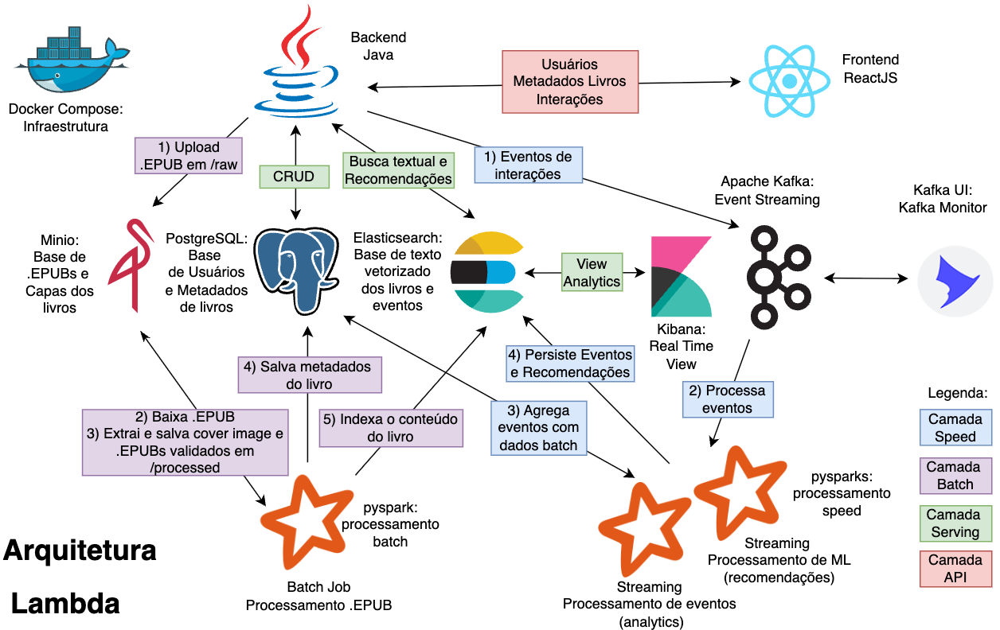

# Boundless Books Backend

The **Boundless Books Backend** is a robust Java Spring Boot application complemented by a pySpark-powered EPUB processing pipeline. It serves as the core infrastructure for the Boundless Books Frontend, handling data management, content processing, and more.

---

## Architecture Overview

At its heart, the backend leverages a well-defined architecture to ensure scalability and efficiency. Below is a visual representation of the system's design:



---

## API Documentation

Explore the functionalities of the Java Backend through its interactive **OpenAPI (Swagger) specification**:

[https://r-moreira.github.io/boundless-books-docs/](https://r-moreira.github.io/boundless-books-docs/)

---

## Getting Started with Docker

This section guides you through setting up and running the Boundless Books Backend using Docker.

### Running the Spring Boot Backend

You have two main options for running the Spring Boot backend: with PostgreSQL and Kafka, or with H2 (in-memory) and no Kafka.

#### With PostgreSQL and Kafka

This configuration is ideal for a full-fledged environment, leveraging PostgreSQL for data persistence and Kafka for messaging.

1.  **Build and Run Containers:**
    ```sh
    # Build all service containers
    docker-compose build

    # Start the application, PostgreSQL, and Kafka containers
    docker-compose up
    ```

2.  **.env Configuration:**
    Ensure your `.env` file (located in the project root) includes the following profile:
    ```
    SPRING_PROFILES_ACTIVE=postgresql,kafka
    ```

#### With H2 (In-Memory) and No Kafka

This option is perfect for quick local development or testing, as it uses an in-memory H2 database and skips Kafka.

1.  **Build and Run Application Container:**
    ```sh
    # Build only the application image
    docker-compose build app

    # Start just the application container, without its dependencies
    docker-compose up app --no-deps
    ```

2.  **.env Configuration:**
    Ensure your `.env` file (located in the project root) includes the following profile:
    ```
    SPRING_PROFILES_ACTIVE=h2
    ```

#### Full `.env` Configuration Example

For a complete reference, here's an example of all possible environment variables you might configure in your `.env` file:

```dotenv
# Profiles options: choose 'h2' or 'postgresql', and optionally include 'kafka'
SPRING_PROFILES_ACTIVE=h2,kafka
#SPRING_PROFILES_ACTIVE=postgresql,kafka # Example for PostgreSQL and Kafka

# Google OAuth2 Credentials (replace with your actual values)
GOOGLE_OAUTH2_CLIENT_SECRET=changeme
GOOGLE_OAUTH2_CLIENT_ID=changeme

# API Key Configuration
API_KEY=changeme
API_KEY_VALIDATION_ENABLED=true

# Mocking for Interaction Events
INTERACTION_EVENTS_MOCK_ENABLED=false

# H2 Database Configuration (for 'h2' profile)
H2_DATASOURCE_URL=jdbc:h2:mem:testdb
H2_DATASOURCE_USERNAME=changeme
H2_DATASOURCE_PASSWORD=changeme

# PostgreSQL Database Configuration (for 'postgresql' profile)
POSTGRES_DATASOURCE_URL=jdbc:postgresql://bb_posgres:5432/postgres
POSTGRES_DATASOURCE_USERNAME=changeme
POSTGRES_DATASOURCE_PASSWORD=changeme

# Kafka Configuration (for 'kafka' profile)
KAFKA_BOOTSTRAP_SERVERS=bb_kafka:9092
```

---

## Running the EPUB Processing Pipeline (Lambda Architecture)
The backend includes a Lambda architecture-based pipeline for processing EPUB files using pySpark;

1.  **Navigate to Pipeline Directory**:
    ```sh
    cd pipeline;
    ```

2.  **Build and Run Containers:
    ```sh
    # Build all pipeline-related containers
    docker-compose build
    
    # Start the pipeline services (e.g., MinIO, PostgreSQL, Elasticsearch)
    docker-compose up
    ```


#### Full `pipeline/.env` Configuration Example

Here's an example of the environment variables for the `pipeline/.env` file:

```.dotenv
MINIO_ROOT_USER=changeme
MINIO_ROOT_PASSWORD=changeme
POSTGRES_DB=changeme
POSTGRES_USER=changeme
POSTGRES_PASSWORD=changeme
ELASTICSEARCH_USERNAME=changeme
ELASTICSEARCH_PASSWORD=changeme
ELASTICSEARCH_SERVICE_TOKEN=changeme
```

---

#### Running Spark Jobs
Once the pipeline containers are up, you can execute various Spark jobs for data processing and analysis.

1.  **Navigate to Scripts Directory**:
    ```sh
    cd pipeline/scripts
    ```

2.  **Execute Spark Jobs**:
   * Batch Process EPUBs:
     ```sh
     ./spark-batch-submit.sh     
     ```
     This script initiates a batch process for all available EPUBs in minio /raw bucket.
     

   * Process Book Events from Kafka (Speed Layer):
     ```sh
     ./spark-speed-submit.sh     
     ```
     This job processes book-related events in real-time from Kafka.     


   * Generate User Recommendations (Machine Learning in Speed Layer)::
     ```sh
     ./spark-ml-submit.sh     
     ```
     This script runs a machine learning job to generate book recommendations based on "read_end" Kafka events.
