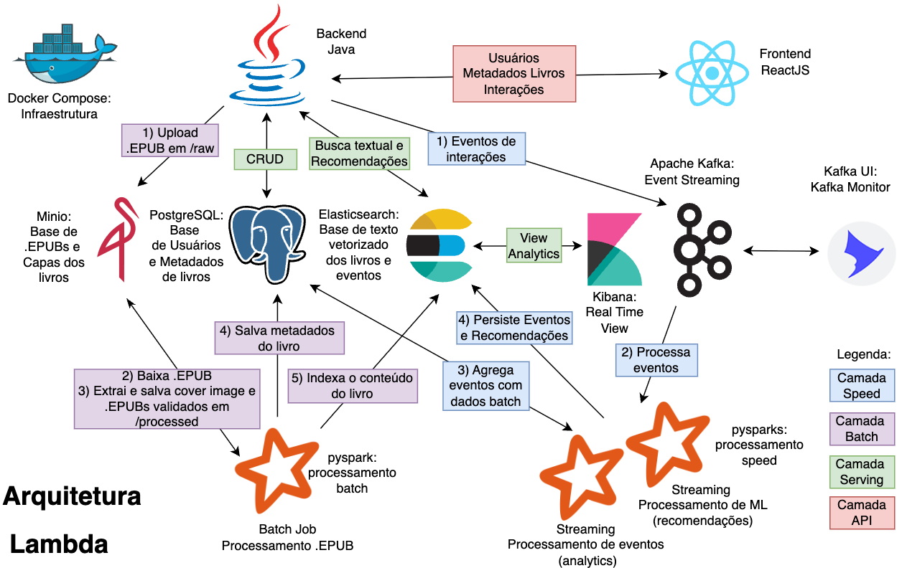

# Boundless Books Backend
This is a Java spring boot app and .EPUBs processing pipeline with pySpark to support the Boundless Book Frontend 

## Backend Architecture


## Run with Docker

### How to run the spring boot backend project with postgres database:
```sh
# Build containers
docker-compose build

# Run the app, postgresql and kafka containers
docker-compose up
```

#### .env file
```SPRING_PROFILES_ACTIVE=postgresql,kafka```

### How to run the project h2 database and no kafka:
```sh
# Build the app image
docker-compose build app

# Run the app container
docker-compose up app --no-deps
```

#### .env file
```SPRING_PROFILES_ACTIVE=h2```

#### Full .env configurations example
```.dotenv
# Profiles options H2 or Postgresql and or not Kafka
SPRING_PROFILES_ACTIVE=h2,kafka
#SPRING_PROFILES_ACTIVE=postgresql


GOOGLE_OAUTH2_CLIENT_SECRET=changeme
GOOGLE_OAUTH2_CLIENT_ID=changeme

API_KEY=changeme
API_KEY_VALIDATION_ENABLED=true

INTERACTION_EVENTS_MOCK_ENABLED=false

H2_DATASOURCE_URL=jdbc:h2:mem:testdb
H2_DATASOURCE_USERNAME=changeme
H2_DATASOURCE_PASSWORD=changeme

POSTGRES_DATASOURCE_URL=jdbc:postgresql://bb_posgres:5432/postgres
POSTGRES_DATASOURCE_USERNAME=changeme
POSTGRES_DATASOURCE_PASSWORD=changeme

KAFKA_BOOTSTRAP_SERVERS=bb_kafka:9092
```


### How to run the lambda architecture pipeline for processing .EPUBs
```sh 
cd pipeline/

# Build containers
docker-compose build

# Run the app, postgresql and kafka containers
docker-compose up
```

#### Full pipeline/.env configurations example
```.dotenv
MINIO_ROOT_USER=changeme
MINIO_ROOT_PASSWORD=changeme
POSTGRES_DB=changeme
POSTGRES_USER=changeme
POSTGRES_PASSWORD=changeme
ELASTICSEARCH_USERNAME=changeme
ELASTICSEARCH_PASSWORD=changeme
ELASTICSEARCH_SERVICE_TOKEN=changeme
```

### How to run spark jobs

```sh
cd pipeline/scripts

# Spark for batch process .EPUBs
./spark-batch-submit.sh

# Spark for process book events from kafka 
./spark-speed-submit.sh

# Spark for generate recommendations to a user based on read_end book event 
./spark-ml-submit.sh
```
